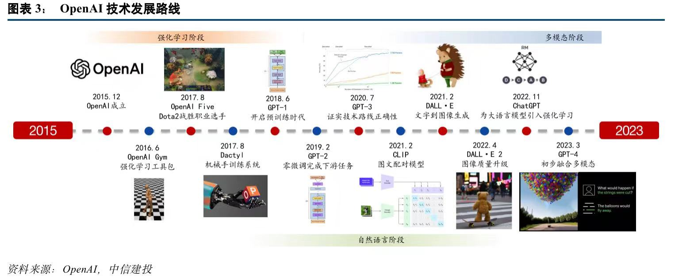

# 飞书知识库：用AI工作学习创作专栏
<table>
    <tr>
            <th>OpenAI技术发展路线</th>
            <th>Transformer模型结构</th>
    </tr>
    <tr>
        <td width="50%"></td>
        <td width="50%"></td>
    </tr>
</table>

## 目录

- [导读-这一次，从门外汉到80分的AI使用者](#导读-这一次，从门外汉到80分的AI使用者)
- [专栏有什么](#专栏有什么？)
- [邀你一起「共建」专栏](#邀你一起「共建」专栏)
## 导读-这一次，从门外汉到80分的AI使用者

AI能改变世界吗？当然！立刻吗？不是。

欢迎你来到《用AI工作学习创作》专栏。与大家一起用AI工作学习创作，探索新知识。

我是阿杰，一个热爱AI和自媒体的程序员。本着开源精神我创建了这个专栏，用来与大家一起，共同学习，用AI工具来工作、学习、创作和变现，提升我们个人能力和工作效率，让我们从繁杂的日常工作中解脱出来，开拓创新，让AI变身我们日常生活、工作中的辅助工具。

我们的目标是不断突破认知，提高您和我们在使用AI方面的水平。

我们旨在降低信息获取成本，减少信息差和冗余，以及避免被不必要的费用割韭菜。

本专栏将在飞书文档持续更新，而且是完全免费的。可以放心分享给你微信置顶的每一个人。

#### [专栏飞书知识库地址：](https://nhrvt0kw31.feishu.cn/wiki/TjZuwJtnfisaqwkRtI4cDQyVngb)<u>https://nhrvt0kw31.feishu.cn/wiki/TjZuwJtnfisaqwkRtI4cDQyVngb</u>

**其他项目地址：**

[Auto-GPT中文版地址](https://github.com/kaqijiang/Auto-GPT-ZH)

[Auto-GPT中文网页版地址](https://www.autogpt-zh.com)

## 专栏有什么？

专栏内目录结构暂定如下，会根据各位老师和同学的反馈实时调整。

[AI每日资讯](https://nhrvt0kw31.feishu.cn/wiki/Pi5Mwtl1nib92okPIsvcbZtvned)栏目，提供关于人工智能的新闻和信息。

如果您想深入了解ChatGPT或MidJourney，可以通过学习它们的[基础知识](https://nhrvt0kw31.feishu.cn/wiki/LGWTwaKyriiBmAkp4dQcJtqTnMd)来获得更全面的了解。

[ChatGPT行业提示](https://nhrvt0kw31.feishu.cn/wiki/LGWTwaKyriiBmAkp4dQcJtqTnMd)提供了多种场景下的提示语模板，可以帮助您在工作、学习和创作中更高效地应对各种情境。

[MidJourney Pormpt](https://nhrvt0kw31.feishu.cn/wiki/DeyBwSWwDi4pTxkmZ0dcTAtOnQf)中包含多种提示语和效果图，可以帮助您更好地学习使用MidJourney绘图。

在[生产力/效率](https://nhrvt0kw31.feishu.cn/wiki/O2Fywz0UHi3ADFkv9ZdcGiX2nBg)方面，我们致力于帮助您快速成为ChatGPT的高效用户，以胜任任何工作和创意。

[应用场景](https://nhrvt0kw31.feishu.cn/wiki/LNgTw6EePikkUWkUVmBcr4Vun4e)中，我们提供了一些实用的方案供您参考和借鉴。

[AI工具](https://nhrvt0kw31.feishu.cn/wiki/VrXnw9NiHiEclnk0l3mc2L77n2c)包含了大量的辅助工具，可以帮助您提升效率，减少繁琐的劳动。

我们希望通过这门专栏，涵盖这些知识，帮助你建立基本的能力圈，在AIGC或者自媒体创作上取得「令人尊敬」的结果。如果你有热情去探索更深，可以沿着专栏的知识体系继续学习，慢慢拓展自己的能力边界。

具体内容在下方。

## 邀你一起「共建」专栏

公众号<阿杰与AI>回复"AI"加入群聊共同探讨更多玩法

 
 
 

最后，我们也想向你发出一份特殊的邀请，请你一起「共建」这门专栏。

与你在其他地方看到的专栏不同，这一次，你不仅仅是「学员」，也是「老师」。

因为我们知道，只有那些在使用过程中困惑、碰壁、不断尝试、改进、优化的人，才更能感同身受每一位使用者真正渴望了解什么，有哪些实实在在的困惑。

同时我也是一个人，我深知自己在很多方面不足，所以我希望你也参与进来一起建设这门专栏。

我们希望你把这些困惑、思考和实践方式，在专栏或者星球中与我们分享。未来，这些珍贵的思考很可能将成为专栏的一部分，点亮更多的同路人。

如果你准备好了，就让我们一起开始这场AI之旅。

### 每日AI资讯

- [最新每日AI资讯](https://nhrvt0kw31.feishu.cn/wiki/Pi5Mwtl1nib92okPIsvcbZtvned)
- 历史资讯见公众号/星球内

### 学习ChatGPT的基础知识
- [AI、OpenAI、MidJourney发展史](./学习ChatGPT的基础知识/1.AI、OpenAI、MidJourney发展史.md)
- [ChatGPT们对今后社会生活的影响](./学习ChatGPT的基础知识/2.ChatGPT们对今后社会生活的影响.md)
- [目前市面比较好的AI产品介绍](./学习ChatGPT的基础知识/3.目前市面比较好的AI产品介绍.md)
- [注册方式汇总](./学习ChatGPT的基础知识/4.注册方式汇总.md)
- [针对初学者的 ChatGPT 速成课程](./学习ChatGPT的基础知识/5.针对初学者的 ChatGPT 速成课程.md)
- [使用ChatGPT前应当学会提问](./学习ChatGPT的基础知识/5.1使用ChatGPT前应当学会提问.md)
- [ChatGPT如何辅助工作](./学习ChatGPT的基础知识/6.ChatGPT如何辅助工作.md)
- [ChatGPT处理Excel Word PPT](./学习ChatGPT的基础知识/6.1ChatGPT处理Excel Word PPT.md)
- [使用ChatGPT面向岗位制作简历、扮演面试官](./学习ChatGPT的基础知识/6.2使用ChatGPT面向岗位制作简历、扮演面试官.md)
- [使用ChatGPT辅助学习](./学习ChatGPT的基础知识/7.使用ChatGPT辅助学习.md)
- [使用ChatGPT助力程序开发](./学习ChatGPT的基础知识/8.使用ChatGPT助力程序开发.md)
- [如何使用ChatGPT协助编写脚本，获取Discord频道中的图片](./学习ChatGPT的基础知识/8.1如何使用ChatGPT协助编写脚本，获取Discord频道中的图片.md)
- [AI各种模型的聊天机器人的接入聊天平台](./学习ChatGPT的基础知识/8.2AI各种模型的聊天机器人的接入聊天平台.md)
- [利用VITS训练与推理AI音声](./学习ChatGPT的基础知识/8.3利用VITS训练与推理AI音声.md)
- [使用Chatgpt搜索文献并导入vosviewer进行文献可视化分析](./学习ChatGPT的基础知识/8.4使用Chatgpt搜索文献并导入vosviewer进行文献可视化分析.md)
- [吴恩达-面向开发人员的 ChatGPT 提示工程](./学习ChatGPT的基础知识/9.吴恩达-面向开发人员的 ChatGPT 提示工程​.md)

### 学习MidJoureny的基础知识
- [1.Midjourney 新手快速起步指南](./学习MidJoureny的基础知识/1.Midjourney 新手快速起步指南.md)
- [2.Prompts-指令](./学习MidJoureny的基础知识/2.Prompts-指令.md)
- [3.Explore Prompting-Prompt的探索](./学习MidJoureny的基础知识/3.Explore Prompting-Prompt的探索.md)
- [4.Blend-叠加](./学习MidJoureny的基础知识/4.Blend-叠加.md)
- [5.Midjourney Discord的使用手册](./学习MidJoureny的基础知识/5.Midjourney Discord的使用手册.md)
- [6.Versions-版本](./学习MidJoureny的基础知识/6.Versions-版本.md)
- [7.Upscalers-放大器](./学习MidJoureny的基础知识/7.Upscalers-放大器.md)
- [8.Midjourney 命令教程](./学习MidJoureny的基础知识/8.Midjourney 命令教程.md)
- [9.Midjourney 参数合集](./学习MidJoureny的基础知识/9.Midjourney 参数合集.md)
- [10.Midjourney Prompt进阶探索](./学习MidJoureny的基础知识/10.Midjourney Prompt进阶探索.md)
- [11.Promp关键词公式](./学习MidJoureny的基础知识/11.Promp关键词公式.md)
- [12.ChatGPT生成 SD 和 Midj 的提示（prompt）](./学习MidJoureny的基础知识/12.ChatGPT生成 SD 和 Midj 的提示（prompt）.md)
- [13.如何使用ChatGPT给出MidJourney提示-【秘密武器】](./学习MidJoureny的基础知识/13.如何使用ChatGPT给出MidJourney提示-【秘密武器】.md)
- [14.如何订阅计划](./学习MidJoureny的基础知识/14.如何订阅计划.md)
### ChatGPT提示词
- [ChatGPT提示词](./ChatGPT提示词/1.ChatGPT提示词.md)
- [ChatGPT提示工程从入门到进阶](./ChatGPT提示词/2.ChatGPT提示工程从入门到进阶.md)
- [提示工程指南](./ChatGPT提示词/3.提示工程指南.md)
- [提示工程简介](./ChatGPT提示词/4.提示工程简介.md)
- [提示词示例](./ChatGPT提示词/5.提示词示例.md)
- [提示技术](./ChatGPT提示词/6.提示技术.md)
- [ChatGPT提示工程](./ChatGPT提示词/7.ChatGPT提示工程.md)
- [GPT-4](./ChatGPT提示词/8.GPT-4.md)
### MidJourney Prompt 

#### V4

- [标志设计](./MidJourney Prompt/V4/标志设计.md)
- [网页&APPUI设计](./MidJourney Prompt/V4/网页&APPUI设计.md)

#### V5

### [生产力/效率](./生产力效率.md)
### 应用
- [抖音B站数字人-FAY](./应用/抖音B站数字人-FAY.md)
- [部署自己的ChatGPT](./应用/部署自己的ChatGPT.md)
- [通过ChatGPT尝试量化交易](./应用/通过ChatGPT尝试量化交易.md)
- [用AI玩转短视频](./应用/用AI玩转短视频.md)
- [ChatGPT接入微信](./应用/ChatGPT接入微信.md)
- [Stable Diffusion部署以及基于云端的模型训练](./应用/Stable Diffusion部署以及基于云端的模型训练.md)
### [AI工具](./工具箱.md)

### GitHub项目

